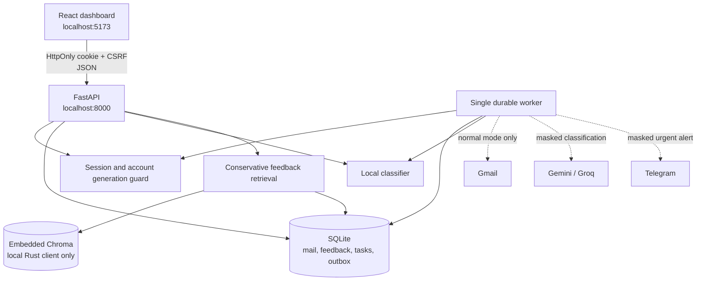

# MailMind

MailMind is a local-first email triage system that classifies saved mail as
**IMPORTANT**, **UPDATES**, or **SPAM**. It combines a FastAPI control plane, a
durable SQLite workflow, conservative feedback retrieval, an optional local model,
and a responsive React dashboard. The supported product is one trusted user on one
workstation; it is not presented as a public multi-tenant service.

> **Evidence before claims:** all automated checks use synthetic data. The current
> personalized model was **not promoted** because its urgent-message regressions are
> unacceptable. Live Gmail, cloud-model and Telegram behavior still requires a
> deliberate test with the operator's own accounts.

## Why this project is interview ready

- Account-scoped sessions, CSRF/origin checks and generation fencing stop stale work.
- Gmail ingestion handles nested MIME, HTML, malformed messages and bounded pages.
- Durable task/outbox states distinguish retries, ambiguous sends and completed work.
- Feedback is committed to SQLite before the derived vector index and can be undone.
- RAG requires current, account-owned, independently supported neighbors and can abstain.
- Prompt inputs are bounded untrusted JSON data, separate from system instructions.
- Local-only mode blocks application provider routes and verifies offline asset hashes.
- Owned launch/stop, nonroot containers, exact locks and clean-release checks make the
  supported environment reproducible.

## Architecture



The API owns browser access and account transitions. The worker owns ingestion and
durable processing. SQLite is authoritative; Chroma is a retryable derived index.
There is no Chroma server or remote Chroma tenant surface in the supported launcher
or Compose stack.

## Security model

Mail and retrieved examples are untrusted. Cloud prompts use one bounded JSON
envelope and a separate system instruction. Provider output must be exactly one JSON
`category` from the shared enum. RAG results are revalidated for account, current
revision, label, finite distance and unique evidence before voting. Three relevant
independent items and a conservative majority are required; otherwise retrieval
abstains. These controls reduce prompt/RAG injection risk but cannot prove that a
statistical model will interpret every adversarial message correctly.

Chroma 1.5.9 remains because upstream has no patched release for the reviewed
server/RBAC advisories. MailMind pins and verifies the embedded Rust backend at
runtime, does not start a Chroma HTTP service, and publishes no Chroma port. The
accepted IDs and boundary are recorded in `config/security-advisory-policy.json`.
Any advisory outside that narrow policy fails `scripts.audit_dependencies`.

Read [SECURITY.md](SECURITY.md), the
[security maintenance report](docs/SECURITY_MAINTENANCE_REPORT.md), and the
[privacy/local-only policy](docs/PRIVACY_AND_LOCAL_ONLY.md) before using real mail.

## Measured model result

The tracked CC0 synthetic benchmark has 180 examples and 36 final-test variants.
Base accuracy was **22/36**; personalization was **25/36**, but urgent misses rose
from 2 to 11 and nine urgent regressions appeared. Retrieval answered only 2/36
and did not improve the hybrid result. The candidate was rejected. These numbers do
not establish real-inbox quality. The packaged checkpoint remains a synthetic demonstration asset.

## Requirements

Validated targets:

- x64 CPython 3.14
- Node 22.17.1
- CPU inference on Windows and the supplied Linux container
- Docker Desktop/Engine with Compose for the container demo

macOS, ARM, GPU execution, remote hosting and multiple simultaneous users are not
claimed supported.

## Clean installation

From a fresh source folder on Windows PowerShell:

```powershell
py -3.14 -m venv venv
venv/Scripts/python.exe -m pip install torch==2.14.0 --index-url https://download.pytorch.org/whl/cpu
venv/Scripts/python.exe -m pip install -r requirements-dev.txt --index-url https://pypi.org/simple
venv/Scripts/python.exe -m pip check
cd frontend
npm ci
npm run build
cd ..
```

On Linux use `python3.14 -m venv venv` and `venv/bin/python`. Install Torch from the
official CPU index first so Linux does not resolve GPU support packages. Python's
exact dependency closure is in `requirements.lock`; npm integrity data is in
`frontend/package-lock.json`. Locks improve repeatability but are not wheel hashes
or a substitute for recurring vulnerability review.

## Safe configuration

The application starts in an honest unconfigured/degraded state. Copy `.env.example`
to `.env` only when optional providers are needed. Never commit `.env`, OAuth JSON,
tokens, databases, exports, private mail, or model weights.

For Gmail:

1. Enable the Gmail API in a Google Cloud project.
2. Configure the consent screen and your test-user access.
3. Create a **Desktop app** OAuth client.
4. Save it as ignored root `credentials.json`.
5. Start MailMind, pair the local browser, then choose **Connect Google**.

MailMind requests Gmail modify scope. `MAILMIND_AUTO_MARK_READ` defaults to false;
when enabled, an IMPORTANT message is marked read only after an alert is confirmed.
Desktop loopback OAuth is not a remote/container callback design.

Optional Gemini, Groq and Telegram values are documented in `.env.example`. Normal
mode sends the minimized payloads described in the privacy policy. Regex masking is
best effort and can miss sensitive context.

## Run the native stack

Build the frontend first, then keep the supervisor terminal open:

```powershell
./start_all.bat
# another terminal
venv/Scripts/python.exe -m scripts.launch status
./end_all.bat
```

Linux:

```bash
bash start_all.sh
bash end_all.sh
```

Open `http://127.0.0.1:5173`. Copy the pairing code from `.run/api.log` into the
page. The supervisor checks port conflicts, waits for readiness, monitors its exact
children and uses an authenticated loopback stop endpoint. Normal shutdown drains
API, worker and UI; a bounded fallback applies only to owned children.

In normal mode, the API and dashboard become ready while the local model loads in an isolated background process. Telemetry reports `loading`; manual `/predict` calls use the configured cloud classifier during that window and automatically return to local inference when loading completes. Saved Gmail processing can proceed with the cloud primary while its local shadow model loads; the shadow is recorded as unavailable during that short window and both results are recorded once local loading completes. Local-only mode never uses this cloud fallback.

The launcher serves `frontend/dist`, not Vite hot reload. During UI development run
`npm run dev` inside `frontend/`, then rebuild before using the normal launcher.

## Local-only mode and assets

Local-only mode skips `.env` when the flag is set before startup and blocks Gmail,
cloud and Telegram application routes. It still needs localhost networking. Prepare
an explicitly synthetic classifier and cached public embedding, then package them:

```powershell
venv/Scripts/python.exe -m scripts.evaluate_priority --output models/new-demo --report-dir docs/evaluation/new-demo
venv/Scripts/python.exe -m scripts.prepare_offline_assets --model models/new-demo/base --embedding-cache <cached-embedding-folder> --output models/offline-demo-v1
```

Use a fresh output directory. Then follow `config/local-only.example.ps1`. Asset
manifests validate presence and SHA-256 integrity, not upstream publisher identity.
Missing/tampered assets fail closed; no cloud fallback occurs in local-only mode.

## Docker demo

After preparing `models/offline-demo-v1`:

```powershell
venv/Scripts/python.exe -m scripts.write_container_manifest
docker compose up --build --wait
# keeps the named data volume
docker compose down
```

The default stack is local-only, loopback-published, nonroot and CPU-only. It mounts
assets read-only, persists SQLite/Chroma data in a named volume, and waits for API
health. `.dockerignore` is an allowlist, so credentials, private data, models, Git
history and virtual environments do not enter the build context. Adding `--volumes`
deletes the demo volume and should be deliberate.

## Synthetic interview demo

```powershell
venv/Scripts/python.exe -m scripts.demo_interview
```

This rehearses three categories, failed-provider and failed-alert recovery, feedback,
retrieval support, account switching and disconnect. Providers and similarity are
fake; API/storage/recovery/account boundaries are real. It is not an accuracy test.

## Verification

Run local checks before sharing a change. GitHub automation is intentionally absent.

```powershell
venv/Scripts/python.exe -m pip check
venv/Scripts/python.exe -m tests.run_baseline --strict
venv/Scripts/python.exe -m unittest tests.test_security_hardening -v
venv/Scripts/python.exe -m scripts.audit_dependencies
venv/Scripts/python.exe -m scripts.verify_local_only --model <classifier> --embedding-cache <cache>
venv/Scripts/python.exe -m scripts.verify_launcher
venv/Scripts/python.exe -m scripts.verify_containers
venv/Scripts/python.exe -m scripts.check_clean_release
cd frontend
npm test
npm run lint
npm run build
npm run test:browser
```

The clean-release helper copies a private-file-free snapshot into a temporary folder,
creates a new venv, installs the exact lock, and runs backend/frontend/browser checks.
The launcher helper uses temporary local-only storage. The container helper creates
an unpredictable Compose project and removes only its own containers/volume.

## Repository map

| Path | Purpose |
| --- | --- |
| `api/` | Protected local HTTP API and lifecycle |
| `src/` | Account state, ingestion, processing, providers, model and retrieval |
| `frontend/` | React dashboard, tests and built-asset server |
| `scripts/` | Explicit maintenance, training, verification and launch tools |
| `tests/` | Synthetic backend regression and security checks |
| `fixtures/` | Public synthetic benchmark fixtures and provenance |
| `config/` | Opt-in local-only example and reviewed advisory policy |
| `docs/` | Phase evidence, model card, privacy, operations and security reports |

## Current limitations

- Real independently labelled inbox evaluation is still required before model use.
- Live Gmail/OAuth, cloud classification and Telegram delivery were not exercised by
  the final automated security pass.
- Masking is not anonymization, and local storage is not an encrypted vault.
- Local-only routing is not an operating-system egress firewall.
- Chroma server/RBAC advisories remain upstream-unpatched; only embedded use is accepted.
- SQLite/single-worker scale is retained for one user; no hosted capacity is claimed.
- Provider retention, quotas and account policies remain outside local control.

## Further documentation

- [Frontend guide](frontend/README.md)
- [Security policy](SECURITY.md)
- [Security maintenance report](docs/SECURITY_MAINTENANCE_REPORT.md)
- [Privacy and local-only policy](docs/PRIVACY_AND_LOCAL_ONLY.md)
- [Setup and release guide](docs/SETUP_AND_RELEASE.md)
- [Operating policies](docs/OPERATING_POLICIES.md)
- [Local scale decision](docs/LOCAL_SCALE_DECISION.md)

## License and data note

The tracked priority benchmark fixture is CC0 as documented in its provenance and
license files. No repository-wide software license is currently declared; add one
before external distribution. Model/data/provider terms remain separate obligations.
