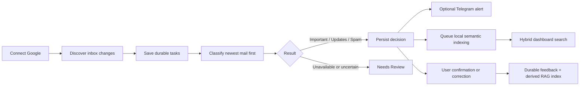
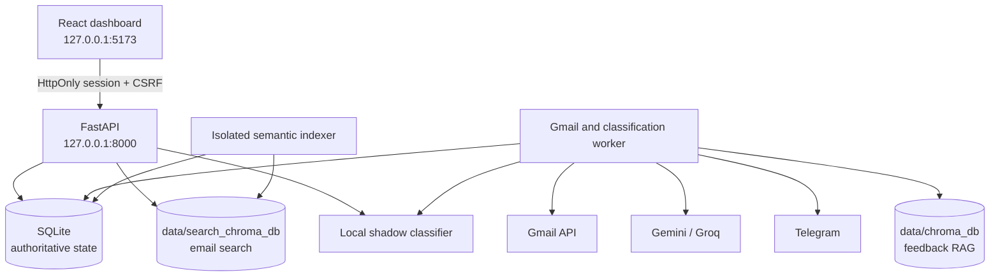

# MailMind

MailMind is a private, local-first Gmail intelligence layer for one trusted user on one workstation. It connects through Google OAuth, discovers new inbox mail, stores durable processing work in SQLite, classifies messages as **Important**, **Updates**, or **Spam**, and exposes uncertain or failed decisions as **Needs Review**.

The React dashboard combines live Gmail intake, recoverable background processing, user feedback, provider health, and hybrid lexical/semantic search. MailMind complements Gmail; it is not intended to replace a full email client or operate as a public multi-user service.

> [!IMPORTANT]
> Mail access and derived processing begin only after a successful Google connection. The semantic-indexer process may be running beforehand, but it waits without reading saved mail, loading the embedding runtime, or opening the semantic search store.

## Highlights

- Google OAuth with automatic completion-page close and safe dashboard fallback.
- Strict account isolation with generation fencing during logout, disconnect, deletion, and account switching.
- Durable SQLite jobs with bounded retries, expiring worker leases, and auditable processing history.
- Three-category classification through Gemini and Groq fallback, plus a local three-class shadow model.
- `NEEDS_REVIEW` as a system outcome—not a fourth model-generated category.
- Conservative feedback retrieval that abstains unless current, account-owned examples provide sufficient independent support.
- Live hybrid search across sender, subject, and body, with exact lexical matches ranked before semantic matches.
- Separate derived Chroma collections for feedback retrieval and inbox search.
- A responsive dark dashboard with health, intake, progress, search, review, feedback, and recovery controls.
- Source-labelled classification explanations, an account-scoped Action Center, and Recharts token-usage trends.
- Explicit saved-mail intelligence backfill in batches of at most 20, with live mail kept ahead of backfill work.
- Optional Telegram alerts and opt-in automatic Gmail mark-as-read behavior.
- Local-only mode with verified pre-provisioned assets and no cloud/Gmail/Telegram routing.

## Product workflow



## Runtime architecture

The native supervisor owns four child processes:

1. **Semantic indexer** — waits for Google connection, then drains durable search-index rows in batches of ten.
2. **API** — serves the local session, account lifecycle, dashboard data, search, feedback, and recovery endpoints.
3. **Gmail/classification worker** — discovers live mail, admits bounded historical work, classifies messages, and handles notification/read-state stages.
4. **Frontend** — serves the built React application at `127.0.0.1:5173`.



SQLite is authoritative. Both Chroma stores are local, embedded, account-scoped derived data that can be rebuilt or reconciled. Semantic indexing is isolated from the Gmail worker so ONNX or Chroma startup cannot block live inbox discovery.

Read [Current architecture](docs/ARCHITECTURE.md) for component boundaries and failure behavior.

## Gmail intake and queue policy

MailMind deliberately separates three kinds of work:

| Workflow | Purpose | User control |
| --- | --- | --- |
| Live sync | Discover messages arriving after the saved Gmail history cursor | **Sync new messages** forces a rate-limited live check |
| Historical backlog | Admit older inbox mail in bounded batches | **Fetch next 100** becomes available after the current older batch finishes |
| Intelligence backfill | Add explanations/actions to already saved eligible mail | **Analyze up to 20 saved emails** is explicit and available only after Action Center extraction is enabled |
| Semantic indexing | Build local derived search embeddings for saved mail | Runs automatically after Google is connected |

Key rules:

- At most 100 processing tasks may be active by default.
- The first connection admits at most the first 100 older messages.
- New live mail uses freed capacity and is processed before old backlog.
- **Sync new messages** never authorizes another historical page.
- **Fetch next 100** controls only older backlog.
- The Gmail worker processes small, newest-first slices to preserve responsiveness.
- Intelligence backfill reuses the durable queue, is capacity-limited, and never sends historical alerts, marks messages read, or creates automatic reminders.
- Semantic documents are capped at 6,000 characters; the stored source email is not shortened by that search-specific limit.

## Classification and feedback

Normal mode uses cloud classification as the authoritative decision. Provider attempts are isolated and bounded:

1. Configured Gemini primary model
2. Configured Gemini fallback model
3. Configured Groq model

Retryable failures can advance to the next provider. Permanent failures and invalid structured output do not silently become Spam. The local model remains a three-category shadow evaluator in normal mode and may be unavailable while loading.

Feedback is committed to SQLite first. The dashboard immediately uses the corrected label, while the derived feedback vector is reconciled asynchronously. A vector-store delay cannot block the user’s correction. Original predictions and revision history remain available for audit and undo.

## Hybrid search

Search begins approximately 300 ms after typing pauses:

- One- and two-character queries use parameterized lexical search only.
- Longer queries can combine lexical results with local semantic candidates.
- Exact text matches remain first.
- Search gracefully falls back to lexical results if semantic search is unavailable.
- Search results remain account-scoped.
- The source email remains unchanged; only the derived embedding document is bounded.

The search index is stored separately from feedback retrieval:

- `data/chroma_db` — feedback/RAG collection
- `data/search_chroma_db` — saved-email semantic search collection

## Account and privacy boundary

The trusted local dashboard opens its loopback session automatically. There is no pairing-code step. Google OAuth is still explicit.

| Action | Effect |
| --- | --- |
| Connect Google | Authorizes Gmail and enables account mail access and processing |
| Switch Google account | Cancels/fences old work, completes OAuth for the new account, and loads only its data |
| Stop processing | Ends the local session and pauses work; saved mail and credentials remain |
| Disconnect Google | Stops Gmail access and removes the selected account’s local OAuth credential; saved local records remain |
| Delete this account data | Removes that account’s managed mail, jobs, feedback, vectors, and credentials |
| Delete old unassigned data | Separately removes explicit legacy/unassigned state |

Restarting invalidates the active local browser session and pauses account work until the trusted dashboard opens a fresh session and Google is reconnected as required. Late operations cannot commit across an account-generation change.

Read [Security policy](SECURITY.md) and [Privacy and local-only policy](docs/PRIVACY_AND_LOCAL_ONLY.md) before using real mail.

## Dashboard

The dashboard provides:

- Account-wide saved, processed, feedback, and measured-latency KPIs
- Live work progress and bounded-queue counts
- Separate live-sync and historical-backlog controls
- Worker, model, provider, and refresh health
- Four category lanes: Important, Updates, Spam, and Review
- Live sender/subject/body/meaning search and category filters
- Classification details, confirmation, correction, undo, and history
- Explicit retry/recovery controls for unfinished processing and ambiguous notifications
- Inbox, Action Center, and Usage tabs with source-labelled explanations and bounded action lifecycle controls
- Day, week, and month token charts that separate provider-billed from locally processed usage
- An explicit, observable saved-mail intelligence backfill control
- Responsive keyboard-accessible layouts and reduced-motion behavior

See [User guide](docs/USER_GUIDE.md) and [Frontend guide](frontend/README.md).

## Requirements

Validated native target:

- Windows x64
- CPython 3.14 virtual environment
- Node.js 22.x
- CPU inference
- Ports `127.0.0.1:8000` and `127.0.0.1:5173`

The supplied Docker Compose configuration is a local-only demonstration. It currently contains API, worker, and frontend services; it does **not** contain the native supervisor’s semantic-indexer service. Do not claim complete semantic-search draining in the Compose demo until that service is added and verified.

## Installation

From PowerShell:

```powershell
py -3.14 -m venv venv
.\venv\Scripts\python.exe -m pip install torch==2.14.0 --index-url https://download.pytorch.org/whl/cpu
.\venv\Scripts\python.exe -m pip install -r requirements-dev.txt --index-url https://pypi.org/simple
.\venv\Scripts\python.exe -m pip check

Set-Location frontend
npm ci
npm run build
Set-Location ..
```

Copy `.env.example` to `.env` only when you intentionally configure providers. Never commit `.env`, `credentials.json`, OAuth tokens, databases, logs, exports, private mail, or private model assets.

For Gmail:

1. Enable the Gmail API in Google Cloud.
2. Configure the OAuth consent screen and test-user access.
3. Create a **Desktop app** OAuth client.
4. Save its ignored JSON file as `credentials.json` in the project root.
5. Start MailMind and choose **Connect Google**.

Detailed setup and release instructions are in [Setup and release](docs/SETUP_AND_RELEASE.md).

## Run

```powershell
.\start_all.bat
```

Open <http://127.0.0.1:5173>.

Status and privacy-safe diagnostics:

```powershell
.\venv\Scripts\python.exe -m scripts.launch status
.\venv\Scripts\python.exe -m scripts.runtime_diagnostics
```

Stop only MailMind-owned services:

```powershell
.\venv\Scripts\python.exe -m scripts.launch stop
```

The supervisor refuses conflicting ports instead of terminating unrelated processes. It restarts the indexer, worker, or frontend within a bounded restart budget; an API exit or exhausted restart budget shuts down the owned service set.

## Verification

Backend:

```powershell
.\venv\Scripts\python.exe -m unittest discover -s tests -v
```

Frontend:

```powershell
Set-Location frontend
npm test -- --run
npm run lint
npm run build
npm run test:browser
```

At the Phase 8 automated verification on 29 September 2026:

- Backend discovery: 478 tests passed.
- Frontend unit suite: 42 passed.
- Playwright browser suite: 24 passed.
- Frontend lint and production build passed.

These are synthetic and temporary-data checks. They do not prove real-inbox model accuracy, provider retention behavior, Telegram delivery, or universal privacy.

See [Test guide](tests/README.md).

## Current limitations

- The approved personal dataset is too limited to claim production classifier quality.
- The local shadow model is useful for evaluation and demonstration, not an accuracy guarantee.
- Regex masking is minimization, not anonymization.
- Local storage is not encrypted by MailMind.
- Local-only mode is an application routing boundary, not an operating-system firewall.
- Gmail desktop OAuth is not a remote hosted callback design.
- The Compose demo does not yet run the semantic indexer.
- Provider quotas, retention, and service policies remain external.
- The supported product is one trusted local user, not a hosted multi-tenant service.
- Automated tests use synthetic or temporary data; the controlled live OAuth/Gmail checklist must be run deliberately before claiming live-provider validation.

## Documentation

- [Documentation index](docs/README.md)
- [User guide](docs/USER_GUIDE.md)
- [Current architecture](docs/ARCHITECTURE.md)
- [Setup and release](docs/SETUP_AND_RELEASE.md)
- [Security policy](SECURITY.md)
- [Privacy and local-only](docs/PRIVACY_AND_LOCAL_ONLY.md)
- [Security design showcase](docs/SECURITY_FEATURES_SHOWCASE.md)
- [Frontend guide](frontend/README.md)
- [Test guide](tests/README.md)
- [Contributing and privacy checks](CONTRIBUTING.md)

## License and data note

The tracked synthetic priority benchmark is CC0 as documented with its fixture provenance. No repository-wide software license is currently declared. Add one before external distribution, and review model, dataset, Gmail, Gemini, Groq, Telegram, and dependency terms independently.
