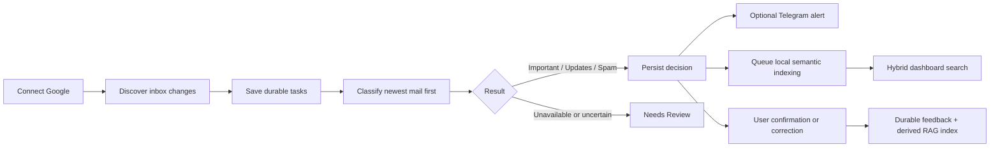
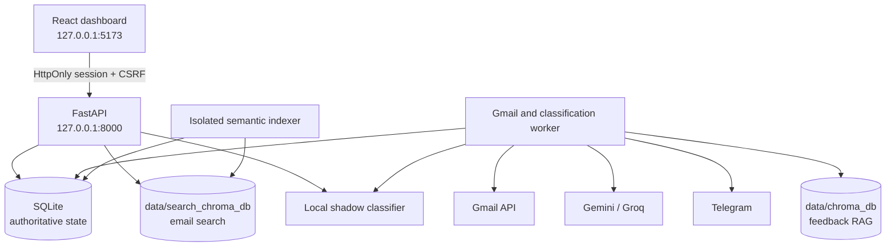

# MailMind

MailMind is a private, local-first Gmail intelligence layer for one trusted user on one workstation. It connects through Google OAuth, discovers new inbox mail, stores durable processing work in SQLite, classifies messages as **Important**, **Updates**, or **Spam**, and exposes uncertain or failed decisions as **Needs Review**.

The React dashboard combines live Gmail intake, recoverable background processing, user feedback, provider health, and hybrid lexical/semantic search. MailMind complements Gmail; it is not intended to replace a full email client or operate as a public multi-user service.

> [!IMPORTANT]
> Mail access and derived processing begin only after a successful Google connection. The semantic-indexer process may be running beforehand, but it waits without reading saved mail, loading the embedding runtime, or opening the semantic search store.

## Highlights

- Google OAuth with automatic completion-page close and safe dashboard fallback.
- Strict account isolation with generation fencing during logout, disconnect, deletion, and account switching.
- Durable SQLite jobs with bounded retries, expiring worker leases, and auditable processing history.
- Three-category classification through Gemini and Groq fallback, plus an optional local three-class shadow model (off by default).
- `NEEDS_REVIEW` as a system outcome—not a fourth model-generated category.
- Conservative feedback retrieval that abstains unless current, account-owned examples provide sufficient independent support.
- Live hybrid search across sender, subject, and body, with exact lexical matches ranked before semantic matches.
- Separate derived Chroma collections for feedback retrieval and inbox search.
- A responsive dark dashboard with health, intake, progress, search, review, feedback, and recovery controls.
- Source-labelled classification explanations, an account-scoped Action Center, and Recharts token-usage trends.
- Explicit saved-mail intelligence backfill in batches of at most 20, with live mail kept ahead of backfill work.
- Optional Telegram alerts and opt-in automatic Gmail mark-as-read behavior.
- Local-only mode with verified pre-provisioned assets and no cloud/Gmail/Telegram routing.

## Product workflow



## Runtime architecture

The native supervisor owns four child processes:

1. **Semantic indexer** — waits for Google connection, then drains durable search-index rows in batches of ten.
2. **API** — serves the local session, account lifecycle, dashboard data, search, feedback, and recovery endpoints.
3. **Gmail/classification worker** — discovers live mail, admits bounded historical work, classifies messages, and handles notification/read-state stages.
4. **Frontend** — serves the built React application at `127.0.0.1:5173`.



SQLite is authoritative. Both Chroma stores are local, embedded, account-scoped derived data that can be rebuilt or reconciled. Semantic indexing is isolated from the Gmail worker so ONNX or Chroma startup cannot block live inbox discovery.

Read [Current architecture](docs/ARCHITECTURE.md) for component boundaries and failure behavior.

## Gmail intake and queue policy

MailMind deliberately separates three kinds of work:

| Workflow | Purpose | User control |
| --- | --- | --- |
| Live sync | Discover messages arriving after the saved Gmail history cursor | **Sync new messages** forces a rate-limited live check |
| Historical backlog | Admit older inbox mail in small batches | Automatic: the first sign-in admits 100; after that, the next 20 load as you page towards the end of your inbox |
| Intelligence backfill | Add explanations/actions to already saved eligible mail | **Analyze up to 20 saved emails** is explicit and available only after Action Center extraction is enabled |
| Semantic indexing | Build local derived search embeddings for saved mail | Runs automatically after Google is connected |

Key rules:

- At most 100 processing tasks may be active by default.
- The first connection admits at most the first 100 older messages.
- New live mail uses freed capacity and is processed before old backlog.
- **Sync new messages** never authorizes another historical page.
- Older mail loads automatically in batches of 20 while you browse the end of the unfiltered inbox; a search or filter never triggers it.
- The Gmail worker processes small, newest-first slices to preserve responsiveness.
- Intelligence backfill reuses the durable queue, is capacity-limited, and never sends historical alerts, marks messages read, or creates automatic reminders.
- Semantic documents are capped at 6,000 characters; the stored source email is not shortened by that search-specific limit.

## Classification and feedback

Normal mode uses cloud classification as the authoritative decision. Provider attempts are isolated and bounded:

1. Configured Gemini primary model
2. Configured Gemini fallback model
3. Configured Groq model

A failed route never ends the chain by itself. Each failure is classified by what it proves:

| Failure | Meaning | What happens |
| --- | --- | --- |
| Timeout, 429, 5xx | Temporary | Cool the model down; try the next route |
| 400, 404, unknown error | This model is broken (e.g. retired) | Cool it down; try the next route |
| 401 / 403 | The shared Gemini key is broken | Skip other Gemini models; go to Groq |
| Non-JSON or out-of-schema answer | This answer is bad | Try the next route, no cooldown |

An email fails only after every route has been tried. It is retried later if any route failed temporarily; otherwise it goes to Needs Review. Invalid output never silently becomes Spam. All 18 fault × scope combinations are tested and rendered in [the resilience matrix](docs/RESILIENCE.md).

The local model is a three-category **shadow**: in normal mode it can run beside the cloud decision for comparison, is metered separately, and never decides — including on manual re-analysis. Because it never decides, it is **off by default** (`MAILMIND_SHADOW_MODEL_ENABLED=false`): MailMind then starts no PyTorch process and spends no CPU on it per email. Set it to `true` to collect shadow comparisons again. In local-only mode it is the authoritative classifier and receives the same sender-aware input it was trained on.

Feedback is committed to SQLite first. The dashboard immediately uses the corrected label, while the derived feedback vector is reconciled asynchronously. A vector-store delay cannot block the user’s correction. Original predictions and revision history remain available for audit and undo.

**Your corrections win for similar mail.** When a new email is close to one you corrected (from the same sender and within cosine distance 0.40, or a near-copy from anyone within 0.20), your category is applied. The AI still runs for the explanation and actions, but cannot overrule you, and "Why this category?" says *Matches your earlier correction*. Only corrections verified against your current labels in SQLite count, so text inside an email can never act as one. On the owner's inbox, a leave-one-out check over 83 labelled emails matched the owner's own label 95% of the time where the rule applied (`src/feedback_rules.py`).

## Hybrid search

Search begins approximately 300 ms after typing pauses:

- One- and two-character queries use parameterized lexical search only.
- Longer queries can combine lexical results with local semantic candidates.
- Exact text matches remain first.
- Search gracefully falls back to lexical results if semantic search is unavailable.
- Search results remain account-scoped.
- The source email remains unchanged; only the derived embedding document is bounded.

The search index is stored separately from feedback retrieval:

- `data/chroma_db` — feedback/RAG collection
- `data/search_chroma_db` — saved-email semantic search collection

## Account and privacy boundary

The trusted local dashboard opens its loopback session automatically. There is no pairing-code step. Google OAuth is still explicit.

| Action | Effect |
| --- | --- |
| Connect Google | Authorizes Gmail and enables account mail access and processing |
| Switch Google account | Cancels/fences old work, completes OAuth for the new account, and loads only its data |
| Stop processing | Ends the local session and pauses work; saved mail remains. The saved Google login is parked unused for 24 hours so Connect Google can reconnect silently, then deleted |
| Disconnect Google | Stops Gmail access; saved local records remain. The saved Google login is parked unused for 24 hours so Connect Google can reconnect silently, then deleted |
| Delete this account data | Removes that account’s managed mail, jobs, feedback, vectors, and credentials |
| Delete old unassigned data | Separately removes explicit legacy/unassigned state |

Restarting invalidates the active local browser session; the trusted dashboard opens a fresh one automatically. If your saved Google login is still valid, Gmail work resumes on its own, with no Connect Google click. Late operations cannot commit across an account-generation change.

Read [Security policy](SECURITY.md) and [Privacy and local-only policy](docs/PRIVACY_AND_LOCAL_ONLY.md) before using real mail.

## Dashboard

The dashboard provides:

- One overview of eight KPI cards: saved, processed, feedback, average classification time, open actions, due soon, overdue, and tokens today
- Live work progress and bounded-queue counts
- Separate live-sync and historical-backlog controls
- Worker, model, provider, and refresh health
- Four category lanes: Important, Updates, Spam, and Review
- Live sender/subject/body/meaning search and category filters
- Classification details, confirmation, correction, undo, and history
- Explicit retry/recovery controls for unfinished processing and ambiguous notifications
- Gmail-style system alerts (offline, can't reach Gmail, service restarting, back online) with exponential-backoff retries; a network drop or service crash never signs you out or blanks the dashboard
- Temporary failures (AI outage or quota, Gmail or Telegram errors) retry until they succeed; only permanent ones stop, with the reason
- Inbox, Action Center, and Usage sections in the top navbar, with source-labelled explanations and bounded action lifecycle controls
- A "Why this category?" explanation inside each email card: a summary, the signals, the quoted evidence that grounds them, and the whole decision (which model decided and whether a backup answered, what the category means, past corrections used as examples, the local second opinion, your own label, and the time taken)
- Action Center filters by status and by action type (only the types the account actually has, with counts), and **Open source** shows the original email in a pop-up with the quoted sentence highlighted (Esc closes it)
- Day, week, and month token charts that separate provider-billed from locally processed usage, with ranked per-provider and per-operation breakdowns
- An explicit, observable saved-mail intelligence backfill control
- A power-on sequence when the dashboard comes up: blocks roll up one after another, then the numbers spool up
- Framer Motion animations: sliding tab pill, card entrances, lane-to-lane moves on relabel, count-up numbers, growing share bars (all switched off by the system reduced-motion setting)
- Responsive keyboard-accessible layouts and reduced-motion behavior

See [User guide](docs/USER_GUIDE.md) and [Frontend guide](frontend/README.md).

## Requirements

Validated native target:

- Windows x64
- CPython 3.14 virtual environment
- Node.js 22.x
- CPU inference
- Ports `127.0.0.1:8000` and `127.0.0.1:5173`

The supplied Docker Compose configuration is a local-only demonstration. It currently contains API, worker, and frontend services; it does **not** contain the native supervisor’s semantic-indexer service. Do not claim complete semantic-search draining in the Compose demo until that service is added and verified.

## Installation

From PowerShell:

```powershell
py -3.14 -m venv venv
.\venv\Scripts\python.exe -m pip install torch==2.14.0 --index-url https://download.pytorch.org/whl/cpu
.\venv\Scripts\python.exe -m pip install -r requirements-dev.txt --index-url https://pypi.org/simple
.\venv\Scripts\python.exe -m pip check

Set-Location frontend
npm ci
npm run build
Set-Location ..
```

Copy `.env.example` to `.env` only when you intentionally configure providers. Never commit `.env`, `credentials.json`, OAuth tokens, databases, logs, exports, private mail, or private model assets.

For Gmail:

1. Enable the Gmail API in Google Cloud.
2. Configure the OAuth consent screen and test-user access.
3. Create a **Desktop app** OAuth client.
4. Save its ignored JSON file as `credentials.json` in the project root.
5. Start MailMind and choose **Connect Google**.

Detailed setup and release instructions are in [Setup and release](docs/SETUP_AND_RELEASE.md).

## Run

```powershell
.\start_all.bat
```

Open <http://127.0.0.1:5173>.

Status and privacy-safe diagnostics:

```powershell
.\venv\Scripts\python.exe -m scripts.launch status
.\venv\Scripts\python.exe -m scripts.runtime_diagnostics
```

Stop only MailMind-owned services:

```powershell
.\venv\Scripts\python.exe -m scripts.launch stop
```

The supervisor refuses conflicting ports instead of terminating unrelated processes. It restarts any owned service that stops (indexer, API, worker or frontend) with backoff (1, 2, 4, 8, 16, 32, then 60 s), for as long as it takes. The only exception is a startup crash loop, where a service fails within 10 s of starting 5 times in a row. MailMind then warns you in the terminal and the dashboard, keeps retrying for 60 s, and shuts down only if the service never recovers.

## Verification

Backend:

```powershell
.\venv\Scripts\python.exe -m unittest discover -s tests -v
```

Frontend:

```powershell
Set-Location frontend
npm test -- --run
npm run lint
npm run build
npm run test:browser
```

Latest local verification (30 September 2026):

- Backend discovery: 590 tests passed, and each of the 25 test modules also passes when run alone (no test-order dependence).
- Provider fault-injection matrix: 18 fault × scope cells match the documented contract (`python -m scripts.render_fault_matrix`).
- Frontend unit suite: 58 passed. Playwright browser suite: 37 passed.
- Frontend lint and production build passed; initial JavaScript is 316 kB (101 kB gzip); the chart (373 kB) and the animation engine (86 kB) load as separate chunks.

These are synthetic and temporary-data checks. They do not prove real-inbox model accuracy, provider retention behavior, Telegram delivery, or universal privacy.

See [Test guide](tests/README.md).

## Evaluation

Every route is evaluated on a 180-email CC0 synthetic benchmark with production-identical requests. The raw answers are recorded, so `python -m scripts.evaluate_cloud --replay` reproduces the [full report](docs/EVALUATION.md) offline, byte for byte.

| Route | Accuracy | Macro-F1 (95% CI) | Urgent misses | Latency p50 |
| --- | ---: | --- | ---: | ---: |
| Gemini `gemini-3.5-flash-lite` | 100% | 1.000 | 0 | 1.3 s |
| Groq `openai/gpt-oss-20b` | 95.6% | 0.974 (0.955–0.990) | 4 | 1.3 s |
| Local DistilBERT shadow | 47.8% | 0.400 (0.304–0.493) | 0 | local |

The perfect Gemini score is a ceiling effect: the benchmark is deliberately unambiguous and cannot rank strong models. The local shadow was trained on a private mailbox and is out of distribution here. `gemini-3.8-flash` (primary) could not be measured because the provider returned 503 "high demand" throughout. These are controlled route comparisons, not real-inbox accuracy.

## What I found in my own audit

A deliberate audit of this codebase found and fixed these defects. Each one was first reproduced as a failing test through the real code path:

| Defect | Impact | Fix |
| --- | --- | --- |
| Failover only on transient errors | A retired model (404) or rejected parameter (400) sent every email to review without trying the fallbacks | Failures are classified by what they prove; see [resilience matrix](docs/RESILIENCE.md) |
| Re-analyze used the shadow model | After startup, the local shadow's label replaced the cloud decision and no actions were extracted | One explicit authoritative route in `src/classification_service.py` |
| Grounding vs privacy mismatch | Actions quoting a redacted span (`[AMOUNT]`) passed validation, then were silently dropped at persistence, including on a retry path | One definition of "the text the provider saw" |
| Training-serving skew | Local-only re-analysis called the model without the sender field it was trained with | The sender is passed on every authoritative local path |
| No label provenance | Retraining could learn from the local model's own outputs; 87% of labels were cloud decisions | Provenance tracked; local self-labels excluded |
| Deadline contract mismatch (found by the evaluation) | The parser rejected plain calendar dates and unresolved deadlines, silently discarding 58% of Gemini's proposed actions | Date-only deadlines anchored to the local day; unresolved ones kept as "unknown": 25/60 → 60/60 on the same recordings |
| Telegram wait shorter than the request | Slow but successful alerts were recorded as "delivery unknown", and a send that never started was too | The worker outlasts the request's own timeouts; "unknown" now means the alert may really have been delivered |
| History paging skipped new mail (found in use) | When 20+ new emails arrived between checks, the next history page was requested with `maxResults=0` (HTTP 400) and the cursor still jumped past the whole batch; failed downloads were also never retried | The cursor only advances past admitted mail; failed downloads are re-fetched; a 5-minute sweep of the last two days' INBOX catches anything history sync misses |
| Text-typed retry times | Retry times stored as text never compared as due in SQLite, freezing the backlog so older mail stopped loading | Each worker cycle repairs non-numeric retry times |
| One quote voided an explanation | A single quote not found byte-for-byte in the email discarded the whole explanation | Punctuation-tolerant grounding shared by explanations and actions; unverifiable quotes are dropped individually |
| Misleading deletion error | An interrupted account deletion reported "no account to delete" while the data was still there | Only a missing account is a conflict; other failures say "retry" |
| Deadlines 5 h 30 min late (found in use) | The model saw the received time in UTC, so "by 5 pm" was saved as 17:00 UTC and shown as 10:30 pm in India | The model sees the received time in the user's zone, and the parser treats a zoneless or wrongly-UTC time as local unless the email names UTC/GMT; 14 stored deadlines repaired after a backup (`src/llm_api.py`) |
| Corrections ignored for similar mail (found in use) | A correction reached the model only as one of ≥ 3 examples within distance 0.25, the model could still ignore it, and after every restart the worker never opened the feedback index | A verified-correction rule: same sender ≤ 0.40, or near-copy ≤ 0.20 (95% agreement with the owner's own labels); the index opens before the first email (`src/feedback_rules.py`, `src/main.py`) |
| Status file crashed MailMind (found in use) | On Windows, renaming over a file another process had open raised "Access is denied", and the uncaught error shut every service down | Status writes only on change, retry briefly, then skip, and never raise; credential saves retry the same way (`scripts/launch.py`, `src/file_utils.py`) |

Live evaluation also found that the previously configured fallback model (`gemini-1.5-flash`) is retired (HTTP 404), which is exactly the case the first fix handles.

## Current limitations

- The approved personal dataset is too limited to claim production classifier quality.
- The local shadow model is effectively a distillation of the cloud classifier: 87% of its training labels are cloud decisions (308 of 356), so its private test score measures agreement with Gemini, not accuracy.
- Cloud accuracy is measured only on a 180-email synthetic benchmark (see [evaluation](docs/EVALUATION.md)), not on real inboxes.
- There is no CI; the test suites are run locally.
- Regex masking is minimization, not anonymization.
- Local storage is not encrypted by MailMind.
- Local-only mode is an application routing boundary, not an operating-system firewall.
- Gmail desktop OAuth is not a remote hosted callback design.
- The Compose demo does not yet run the semantic indexer.
- Provider quotas, retention, and service policies remain external.
- The supported product is one trusted local user, not a hosted multi-tenant service.
- Automated tests use synthetic or temporary data; the controlled live OAuth/Gmail checklist must be run deliberately before claiming live-provider validation.

## Documentation

- [Documentation index](docs/README.md)
- [User guide](docs/USER_GUIDE.md)
- [Current architecture](docs/ARCHITECTURE.md)
- [Setup and release](docs/SETUP_AND_RELEASE.md)
- [Security policy](SECURITY.md)
- [Privacy and local-only](docs/PRIVACY_AND_LOCAL_ONLY.md)
- [Security design showcase](docs/SECURITY_FEATURES_SHOWCASE.md)
- [Classifier evaluation](docs/EVALUATION.md)
- [Provider resilience matrix](docs/RESILIENCE.md)
- [Performance measurements](docs/PERFORMANCE.md)
- [Frontend guide](frontend/README.md)
- [Test guide](tests/README.md)
- [Contributing and privacy checks](CONTRIBUTING.md)

## License and data note

Copyright © 2026 Priyansh Waghela. All rights reserved. The source is published for viewing and evaluation; no license to use, copy, modify, or distribute it is granted.

The synthetic priority benchmark in `fixtures/priority_benchmark/` is CC0, as documented in its provenance file. Model, dataset, Gmail, Gemini, Groq, Telegram, and dependency terms apply independently.
