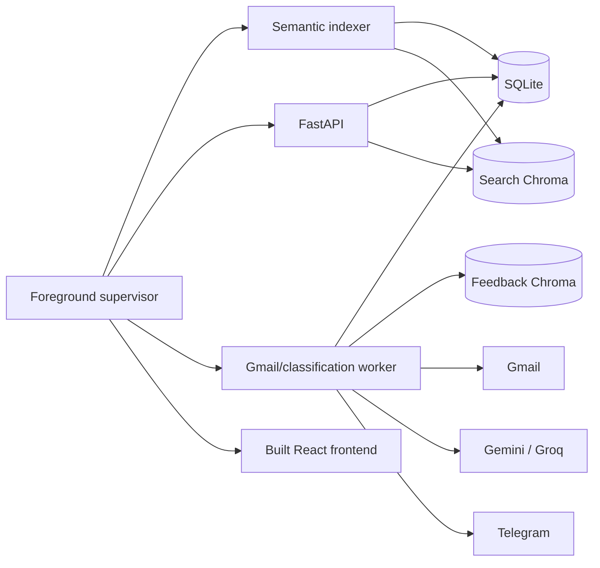
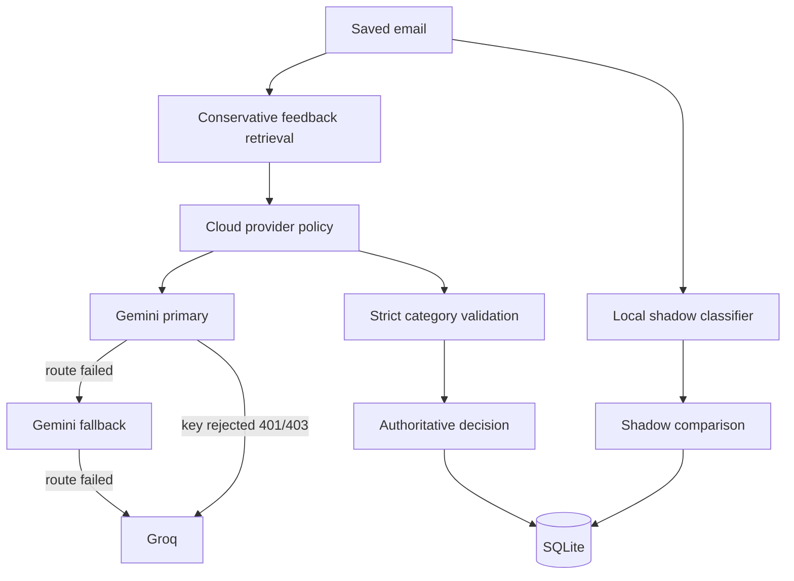

# MailMind architecture

## Scope

MailMind is a local desktop application for one trusted user and one selected Gmail account at a time. Multiple accounts may be connected sequentially, but their mail, feedback, jobs, vectors, credentials, and runtime state remain isolated.

The supported native runtime binds the API and dashboard to loopback. It is not a public or multi-tenant service.

## Process model

### Supervisor

`scripts.launch` owns exact child-process objects and a private state file under `.run`. It:

- refuses startup if ports 8000 or 5173 are already occupied;
- starts the semantic indexer first and waits for its readiness marker;
- starts the API and waits for its health response;
- starts the worker and built frontend;
- monitors every owned child;
- restarts any owned service that exits, the API included, with backoff (1, 2, 4, 8, 16, 32, then 60 s) and no restart limit;
- treats only a startup crash loop (5 exits in a row, each within 10 s of starting) as unrecoverable: it warns in the terminal and, through `.run/supervisor-status.json` served by the frontend server as `/mailmind-supervisor.json`, in the dashboard, keeps retrying for 60 s, and shuts the owned set down only if the service never stays up. The status file is rewritten only when it changes, and a rename blocked by Windows ("Access is denied" while the dashboard server or antivirus has it open) is retried briefly, then skipped; it can never stop MailMind. Credential saves use the same retrying rename (`src/file_utils.py`), but still raise if the file stays locked;
- accepts authenticated loopback stop requests; and
- never kills unrelated processes by name or port.

### Semantic indexer

The indexer is isolated so embedding or Chroma work cannot block Gmail polling.

Before Google is connected, the process only announces that it is waiting and ready. It does not read saved mail, initialize the embedding runtime, or open the search collection. After connection, it obtains a generation-fenced account context and reconciles ten rows per batch.

Search documents contain normalized sender, subject, and searchable body text, capped at 6,000 characters. The original stored email is unchanged.

### API

FastAPI owns:

- trusted-loopback session creation;
- HttpOnly session cookies and CSRF enforcement;
- account lifecycle operations;
- dashboard status and telemetry;
- paginated email reads;
- lexical and hybrid search;
- feedback, undo, and history;
- Action Center reads/mutations, token analytics, and source-labelled explanations;
- forced live sync and bounded backlog authorization; and
- explicit bounded saved-mail intelligence backfill; and
- explicit recovery for unfinished tasks and ambiguous notification delivery.

The API opens/migrates schema version 14 and lazily initializes heavy or optional services.

### Gmail/classification worker

The worker runs small, newest-first cycles. Each cycle:

1. validates the active account generation;
2. acquires an expiring lease;
3. prioritizes live history-cursor changes;
4. fills remaining capacity with ordinary historical backlog before intelligence backfill;
5. processes a bounded number of durable tasks;
6. records classification, notification, and mark-read stages; and
7. updates heartbeat, success, and safe error state.

Cloud providers, Gmail, Telegram, retrieval, local inference, credential refresh, and search use isolated bounded-call capacity where applicable.

### Frontend

The production launcher serves `frontend/dist` through the owned Node server. React never receives Gmail OAuth credentials or provider keys. It polls coherent account snapshots, aborts stale requests, rejects mixed-account responses, and disables mutations when the last snapshot is stale.

## Persistence

### SQLite: authoritative state

SQLite stores:

- account/session generation state;
- emails and source text;
- ingestion cursors and historical backlog state;
- processing tasks and attempts;
- classification and local-shadow results;
- notification outbox state;
- feedback revisions;
- semantic-index reconciliation state;
- worker health; and
- source-labelled analysis, extracted actions, reminders, privacy-safe token events, mutation limits, and intelligence-backfill state; and
- background authentication and processing jobs.

Task states include `queued`, `running`, `retry`, `complete`, and `dead`. A successful category is never invented from a processing failure.

### Chroma: derived state

MailMind uses embedded Chroma only:

| Directory | Purpose |
| --- | --- |
| `data/chroma_db` | Current account-owned feedback examples for conservative retrieval |
| `data/search_chroma_db` | Saved-email embeddings for local semantic search |

SQLite remains the source of truth. Vector writes are account-namespaced, revision-checked where relevant, and retryable. The application does not run or expose a Chroma HTTP server.

## Intake model

### Live mail

A saved Gmail history cursor supports partial synchronization. Live changes are checked automatically and can be forced with **Sync new messages**. The forced action is durable and rate-limited.

The cursor only advances after the messages it covers have been admitted. A full batch stops paging (the rest is read from the same cursor next cycle), and a failed history call keeps the old cursor.

Two backstops make sure mail is never lost silently:

- a message whose download failed is fetched again by ID when its retry is due. Temporary failures (network, Gmail 5xx/429) retry until Gmail answers; a deleted or unparseable message is quarantined after the attempt limit;
- every five minutes the worker lists INBOX messages from the last two days and fetches any it has not saved, within the normal queue capacity.

### Historical backlog

Older mail is deliberately bounded:

- the initial connection admits at most 100 items;
- older pages pause after the admitted batch;
- after that, the dashboard authorizes the next 20 automatically when the user reaches the last two pages of the unfiltered inbox, and only after the previous older batch has been processed (`POST /ingestion/fetch-next`, limit 1–100, default 20); and
- historical work cannot consume capacity reserved by the global active-task cap.

### Saved-mail intelligence backfill

Backfill is never automatic. A connected user must select **Analyze up to 20 saved emails**, and Action Center extraction must already be enabled. Admission is account-scoped, idempotent, limited to 100 per API request and 20 by the current UI, and constrained by the same active-task cap as ordinary work.

Backfill reuses the existing processing queue and provider/local instrumentation. It can persist classification, source-labelled analysis, action candidates, and token events. It suppresses historical Telegram alerts, Gmail mark-read calls, and automatic reminder creation. Its durable states are queued, running, retry, complete, and dead; an expired worker claim returns it to retry.

The private, CSRF-protected `POST /intelligence/backfill` route accepts `{"limit": 1..100}` and returns a durable job acknowledgement plus requested, admitted, eligible, and remaining-capacity counts. It returns conflict when no eligible mail or capacity remains. `GET /status` exposes rollout availability and account-scoped backfill counts. The existing task-retry route resets a failed backfill marker with the task; completed rows remain idempotently excluded.

### Priority

New live mail is admitted and processed before older backlog, and ordinary backlog is processed before intelligence backfill. The default active-task cap is 100. The worker time-slices processing to keep Gmail discovery responsive.

## Intelligence data flow

Validated provider output can add a bounded explanation and action candidates to the authoritative classification. Explanations remain source-labelled and do not expose hidden reasoning. Action candidates pass strict type, confidence, evidence, date, and lifecycle checks before becoming account-owned Action Center rows.

**Deadline time zone (TZ-01).**
- The model sees `email.received_at` in the configured zone (`MAILMIND_DEFAULT_TIMEZONE`, default Asia/Kolkata, e.g. `…T17:00:00+05:30`), and is told that a time written without a zone ("5 pm") is local and must carry the same offset.
- `_parse_due_at` backs this up in code: a deadline with no offset is local, and an exact-time deadline marked UTC is treated as local unless the email itself mentions UTC/GMT or a +00:00 offset. A zone the email states (e.g. EDT) is kept, and a bare date can't claim to be an exact time.
- Before this fix the model saw the received time in UTC and returned "5 pm" as 17:00Z, which the browser showed as 22:30 in India. The 14 affected stored deadlines were repaired once (backup first, fingerprints recomputed, one pending reminder shifted).

Token events contain counts and operational metadata, never email text or provider responses. Provider-billed and locally processed totals stay separate. Day, week, and month aggregation uses configured local-calendar boundaries.

## Classification model

Failover classifies each failure by what it proves (every case is tested in [the resilience matrix](RESILIENCE.md)):

- temporary (timeout, 429, 5xx): cool the model down, try the next route;
- broken model (400, 404, unknown error): cool it down, try the next route;
- rejected Gemini key (401/403): skip the other Gemini models, go to Groq;
- invalid answer: try the next route without a cooldown.

An email fails only after every route is tried. It stays retryable if any route failed temporarily; otherwise it goes to Needs Review. Gemini 3+ models are sent `thinking_level: low`; older models, which reject it, are not.

All routing rules live in `src/classification_service.py`, shared by the worker and the API:

- normal mode: the cloud decides; the local model runs only as an optional shadow (off by default, `MAILMIND_SHADOW_MODEL_ENABLED`), including on re-analysis. When it is off, no model process starts and no shadow is recorded;
- local-only mode: the local model decides, with the same sender-aware input it was trained on.

Grounding uses one rule, `quote_in_source()` in `src/email_text.py`, for both explanation signals and action evidence. It checks against the same privacy-minimized text the provider saw, ignores differences in quote marks, dashes, ellipses and whitespace, and requires the words to match exactly.

Only `IMPORTANT`, `UPDATES`, and `SPAM` are model categories. `NEEDS_REVIEW` is a system presentation state for unavailable, ambiguous, or failed processing.

Feedback retrieval may support a decision only when current account-owned examples are close enough, revision-valid, independently supported, and sufficiently dominant. Otherwise it abstains.

**Correction rule (cloud mode).** `classify_email` retrieves up to 8 of the account's corrections within cosine distance 0.40, validated by `CurrentFeedback` (current label and revision in SQLite). `match_correction` (`src/feedback_rules.py`) picks the nearest correction that is either from the same sender address within 0.40 or a near-copy within 0.20. If one matches, the final category is the user's label: the AI's actions are kept, and the explanation becomes "Matches your earlier correction" with the `feedback_precedent` signal. The AI's own examples are unchanged (3 nearest within 0.25, only when 3 exist). Without the SQLite-backed hook, retrieved text can never force a label. Before classifying a cycle's first email, the worker opens the feedback index (bounded, for this data folder only). Before this, it opened only when a new correction needed saving, so after a restart every lookup failed with `retrieval_not_initialized` and corrections were silently ignored (FB-02). The thresholds come from a leave-one-out evaluation on the owner's 83 labelled emails: 55 covered, 52 matching the owner's label (95%); 0.45 dropped to 90%.

## Notification and read-state safety

Telegram delivery is recorded through a durable outbox. A request that might have reached Telegram but lacks a safe acknowledgement becomes `unknown`; it is not automatically resent. The worker waits longer than the request's own connect and read timeouts, so a slow but successful send is recorded as sent. The worker also marks the moment a send is handed to Telegram: a failure before that point sent nothing and is simply retried.

Automatic mark-as-read defaults to off. When enabled, it remains a separate durable stage. Important mail is not automatically marked read before required notification success.

## Account transitions

Logout, disconnect, account switching, deletion, and restart advance or invalidate account/session generations. Slow operations check their original context before and after external work. A late response cannot commit into a new account generation.

The semantic indexer follows the same fence and pauses during authentication or purge transitions.

## Search ranking

Lexical SQL search is parameterized and treats wildcard characters literally. For queries of at least three characters, semantic candidates may be added. Hybrid ranking keeps exact lexical matches first and adds related semantic matches afterward.

If embedding or Chroma query work fails, the API logs a safe event and returns lexical results.

## Failure isolation

- Semantic indexing cannot block Gmail because it runs in another process.
- Feedback persistence does not wait for vector indexing.
- Provider timeouts do not consume unrelated Gmail or Telegram capacity.
- A poisoned message does not stop the batch.
- An expired lease prevents a stale worker from committing.
- A malformed (non-numeric) retry time cannot strand a task: each worker cycle repairs it, because SQLite ranks text above every number.
- Temporary failures never give up. Classification (AI outage, quota, timeout), Telegram alerts, reminders and Gmail downloads keep retrying with backoff capped at 5 minutes; the search index retries on the same schedule, and feedback indexing gets a few quick tries, then retries every 5 minutes. Permanent failures stop at once with the reason: a rejected or invalid request, invalid model output, unconfigured Telegram, or an ambiguous send that might already have been delivered (never resent automatically).
- Disconnect and Stop processing park the OAuth credential (`<digest>.parked.json`, timestamped) instead of using or deleting it. Background work only reads the live credential, so a parked one is never used. Connect Google while disconnected first tries `renew_saved_login`: it refreshes the parked (or paused) credential with a bounded timeout and checks the account matches. On success the account reconnects with no browser flow; otherwise the normal OAuth page opens. Parked credentials older than 24 h are deleted on restart and before each reconnect, and Delete account data removes them at once. Switching accounts while connected never uses the silent path.
- An API restart keeps Google connected when the saved login file still exists and no deletion is pending. It still revokes browser sessions and bumps the generation, so work from before the restart is fenced out.
- Losing the internet does not sign the user out. The per-cycle Gmail check separates a proven login problem (rejected refresh, 401/403, wrong account), which pauses the account, from network trouble or a Gmail outage, which keeps it connected. The cycle is skipped, so emails don't spend their retries while offline, and the worker backs off exponentially: 5, 10, 20, 40, then every 60 s. `/status` reports the failed-check streak and the seconds until the next check, and the dashboard shows Gmail-style connectivity alerts while keeping the saved mail on screen.
- An interrupted intelligence backfill is recovered through the same lease/retry path without repeating historical side effects.
- Unknown notification delivery requires explicit recovery.
- Historical transient runtime errors are cleared after restart or a successful worker cycle.

## Container boundary

The native supervisor owns four services. The current Compose demonstration owns API, worker, and frontend only and runs in local-only mode. It does not currently include the semantic indexer; therefore the container documentation does not claim complete semantic search indexing.

