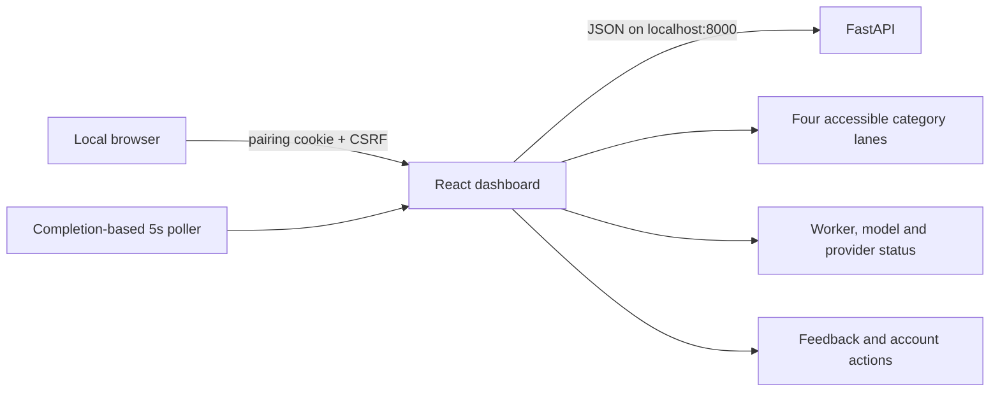

# MailMind frontend

The dashboard is a React 19 and Vite application for the local MailMind API. It
shows saved email classifications, durable worker/retry state, provider readiness,
feedback history and account actions. It does not contain provider keys, model
weights or an independent authentication system.

## Architecture



`src/api.js` owns request timeouts, cookies, CSRF headers and response validation.
`src/dashboard.js` loads a consistent account generation and rejects mixed-account
responses. `src/hooks/useDashboard.js` owns polling, aborts stale requests and
serializes mutations. Components render API text through React; the source contains
no raw-HTML rendering sink.

## Requirements

- Node 22.17.1 (see `.nvmrc` in the repository root)
- The exact packages in `package-lock.json`
- For the normal UI, a MailMind API listening on `127.0.0.1:8000`

## Install and build

From this directory:

```powershell
npm ci
npm test
npm run lint
npm run build
```

Run the development server with `npm run dev`. The production launcher does not use
Vite's development server; it serves `dist/` through `serve.mjs`, so rebuild after
frontend changes.

## Browser tests

```powershell
npx playwright install chromium
npm run test:browser
```

The browser suite uses a synthetic in-browser API fixture. It does not sign in to
Google, read an inbox, call cloud models or deliver Telegram messages. Keep ports
5173 and 8000 free for the real launcher checks described in the root README.

## Security and privacy behavior

- Requests include credentials only for the local API and mutation requests include
  the session CSRF token.
- The API enforces allowed origins and account generations; the UI also rejects a
  refresh that mixes responses from different account generations.
- Provider and email text is rendered as React text, not injected HTML.
- Account deletion requires an explicit browser confirmation. Logout, disconnect
  and deletion have different effects described beside the controls.
- Local-only mode disables Google/cloud/alert actions and reports that state.
- Normal mode shows `Loading` while the API model initializes; configured cloud classification handles manual predictions during that window.
- A failed refresh leaves the last snapshot visible but disables mutations.

The frontend cannot make an unsafe backend or an untrusted workstation safe. Pairing
codes and local browser access must still be protected. Regex masking is best effort,
and live provider behavior remains outside the synthetic browser test scope.

## Main files

| File | Responsibility |
| --- | --- |
| `src/App.jsx` | Page composition, filtering and pagination |
| `src/api.js` | Bounded API client and response contracts |
| `src/dashboard.js` | Coordinated dashboard reads and display helpers |
| `src/hooks/useDashboard.js` | Polling, cancellation and mutation lifecycle |
| `src/components/` | Account, metrics, board and email-card UI |
| `src/index.css` | Responsive, keyboard-visible, reduced-motion-aware styles |
| `serve.mjs` | Minimal built-asset server for the owned launcher/container |
| `tests/` | Unit tests for API/polling/dashboard behavior |
| `e2e/` | Synthetic Playwright interaction and responsive tests |

For complete installation, model/assets, Docker and release instructions, use the
[root README](../README.md). For known limits, read the model card and security
report linked there.
